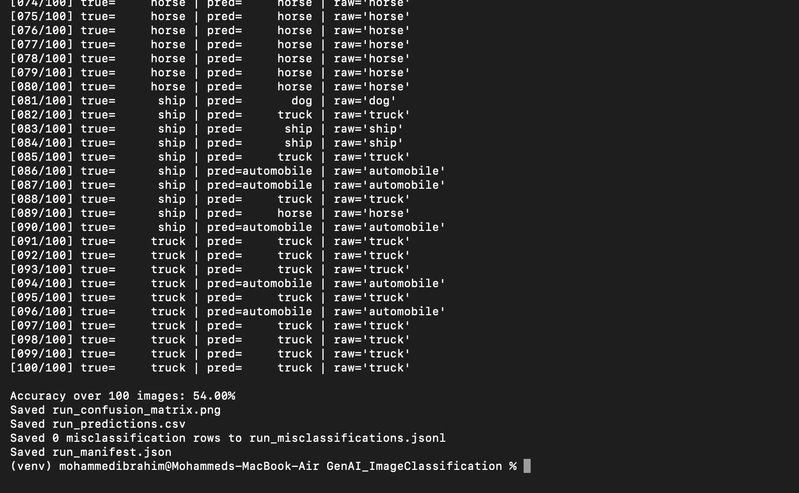
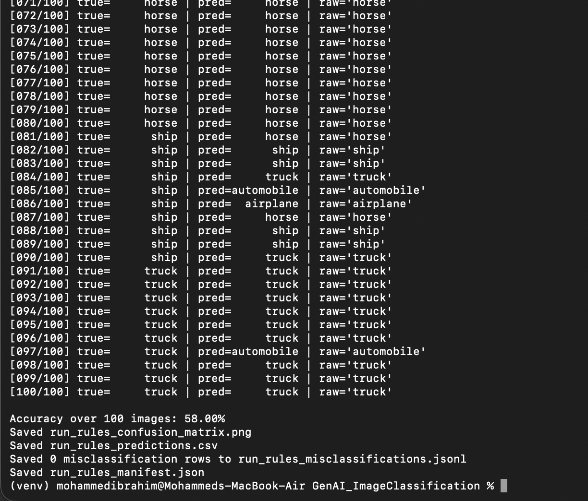

# GEN_AI Tools: Image Classification Using Vision-Language Model  

---

## 1. Introduction  

This project explores how Vision-Language Models (VLMs) can classify images using natural language prompts rather than explicit model retraining. The assignment employs the Gemma3:4b model hosted on [ai.sooners.us](https://ai.sooners.us), a multimodal model capable of interpreting both images and text.  

The dataset used was CIFAR-10, which consists of ten classes of 32×32 color images: airplane, automobile, bird, cat, deer, dog, frog, horse, ship, and truck. The objective was to send these images to the model via an OpenAI-compatible API, prompt it for class predictions, and measure performance using accuracy and a confusion matrix.

---

## 2. Environment Setup  

All API credentials were stored securely in the `.soonerai.env` file located in the user’s home directory:
```
SOONERAI_API_KEY=your_key_here
SOONERAI_BASE_URL=https://ai.sooners.us
SOONERAI_MODEL=gemma3:4b
```

Dependencies were installed inside a virtual environment using:
```bash
python3 -m venv venv
source venv/bin/activate
pip install -r requirements.txt
```

---

## 2.1 How to Run the Code

After installing dependencies and creating your .soonerai.env file, run the following commands to reproduce both experiments:
# Baseline prompt classification
```bash
python3 cifar10_classify.py --system-prompt baseline --out-prefix run_baseline
```

# Rules-based prompt classification
```bash
python3 cifar10_classify.py --system-prompt rules --out-prefix run_rules
```

This will:
Load and sample 100 images (10 per CIFAR-10 class).
Send each image to the Gemma3:4b model via the ai.sooners.us API.
Compute accuracy and save the confusion matrix and prediction files.
The results will be saved as:
```bash
run_baseline_confusion_matrix.png
run_rules_confusion_matrix.png
run_predictions.csv
run_misclassifications.jsonl
```
---

## 3. Experimental Methodology  

Two system prompts were tested:  

1. **Baseline Prompt** – A direct instruction to classify each image into one of the ten CIFAR-10 labels without any descriptive reasoning.  
2. **Rules Prompt** – A more descriptive prompt containing semantic hints about shape, context, and distinguishing features.  

For each run, the script sampled 100 images (10 per class) with a fixed random seed, encoded them in base64, and sent them to the API via the `/api/chat/completions` endpoint. The model’s responses were parsed, normalized, and compared against ground-truth labels to compute accuracy and produce a confusion matrix.

---

## 4. Results  

The baseline prompt achieved an overall accuracy of 54%, while the rules prompt improved accuracy to 58%, representing a 4% gain. Although modest, this improvement indicates that prompt wording significantly influences VLM behavior.

Misclassifications in the baseline run frequently involved visually similar categories such as automobile and truck, cat and dog, and airplane and ship.  
The rules-based prompt reduced errors by guiding the model’s attention toward structural differences—such as the presence of wings, fuselage, or water backgrounds—resulting in better reasoning.

```bash
| Prompt | Accuracy |
|---------|-----------|
| Baseline | 54% |
| Rules | 58% |
```

---

### Confusion Matrices  

**Baseline Prompt**  


**Rules Prompt**  


---

### Terminal Outputs  

**Baseline Run Output**  


**Rules Run Output**  


---

## 5. Discussion  

The experiment demonstrates that prompt engineering can meaningfully affect multimodal model accuracy even without retraining. The results suggest that when VLMs are given explicit structural cues, they rely more on reasoning rather than shallow pixel similarities.  

While the baseline model treated the task as a direct classification problem, the rules prompt reframed it as a reasoning task: associating shapes and contexts with class semantics. This aligns with current research showing that multimodal models perform better when guided by hierarchical, descriptive prompts.

The small improvement from 54% to 58% may seem minor but is significant given the small dataset (100 samples) and the model’s general-purpose nature. It shows that linguistic framing can serve as an efficient, low-cost substitute for fine-tuning.

---

## 6. Reproducibility and Security  

- API credentials are stored only in `~/.soonerai.env` and excluded from version control.  
- The random seed (`1337`) ensures identical sampling across runs.  
- Dependencies are specified in `requirements.txt` for environment consistency.  
- Outputs include logs, confusion matrices, and prediction files that can be independently verified.  

---

## 7. Conclusion  

This project confirms that prompt clarity and contextual structure directly influence VLM accuracy. By shifting from a minimal baseline prompt to a descriptive rules-based one, classification accuracy improved from 54% to 58%. The results illustrate that even without retraining, well-designed prompts can enhance the interpretive reasoning of vision-language models, particularly on small and low-resolution datasets such as CIFAR-10.  

These findings reinforce the broader principle that language design is an integral part of effective AI system performance.
  
